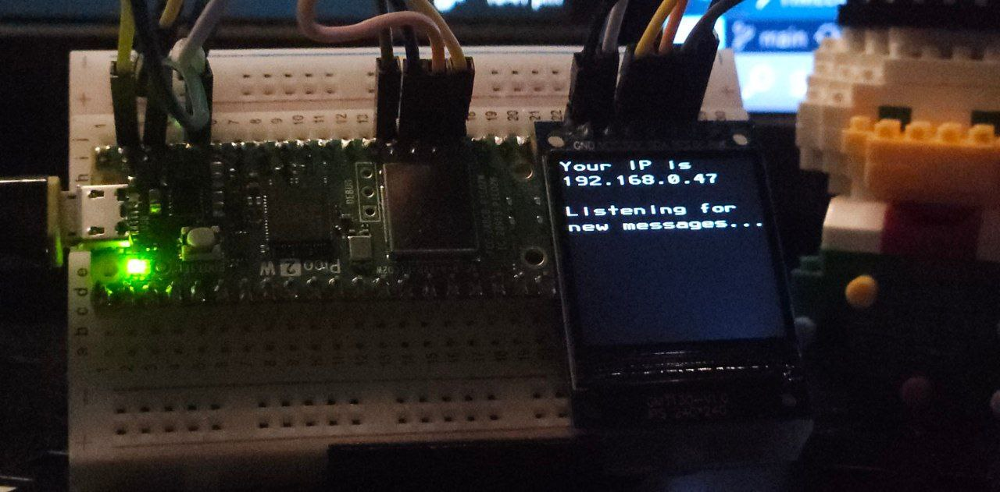

# The Pico Pager

This simple device receives text messages from your Telegram bot and displays it on an SPI display.

## Introduction

This mini project was made in the midsts of tinkering with the Raspberry Pico 2W and the ST7789 LED display. I used Jordi Prats's [utelegram library](https://github.com/jordiprats/micropython-utelegram) and a [ST7789 library](https://github.com/russhughes/st7789_mpy) from Russhughes.

## Parts and Pinout

1. Raspberry Pico 2W
2. Breadboard
3. Jumper wires x6
4. ST7789 SPI LED

| SPI 	| PICO 2W  	|
|-----	|----------	|
| RES 	| GP21     	|
| DC  	| GP20     	|
| SDA 	| GP19     	|
| SCK 	| GP18     	|
| GND 	| GND      	|
| VCC 	| 3V3(OUT) 	|


## Setup

Create a bot token and paste it in `main.py`, along with your WiFi SSID, password and timezone:

```python
# In main.py
Token = 'YOUR TOKEN'
SSID = 'WIFI NAME'
PASSWORD = 'WIFI PASSWORD'
GMT = 8
```

## Limitations

1. Cannot display images/videos
2. Cannot display stickers